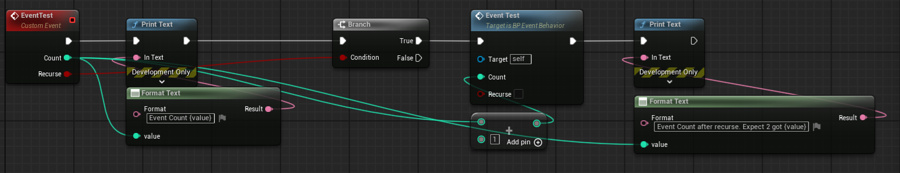
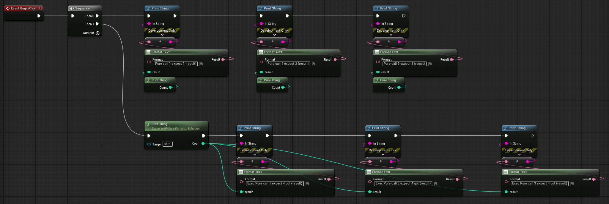
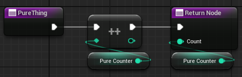
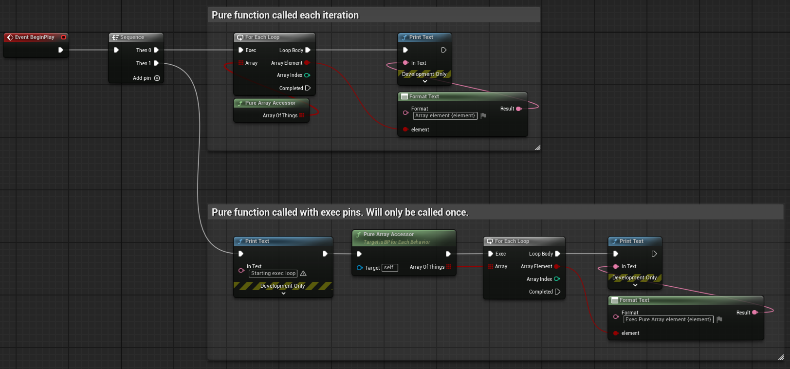
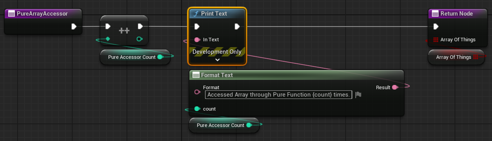

# Unreal Proofs
This repo has some Unreal blueprints that demonstrate behavior that is worth knowing about when coding in that system.

## BP_EventBehavior
This proof shows how events store their inputs on a heap instead of a stack. The inputs will always store the last value they got.



This code works by creating an event and calling it recursively with a counter. It will print the input, check if it should call itself and if so it will call itself with an incremented counter then print out the original counter value. When the 2nd print is written after calling recursively count will be upated to the new value. So if the input is 1 you will see 1, 2, 2 printed. If there was a stack you would expect 1, 2, 1.

5.5.4 Engine output:
```
LogBlueprintUserMessages: [BP_EventBehavior_C_1] Event Count 1
LogBlueprintUserMessages: [BP_EventBehavior_C_1] Event Count 2
LogBlueprintUserMessages: [BP_EventBehavior_C_1] Event Count after recurse. Expect 2 got 2
```

## BP_PureFunctionBehavior
This proof shows how pure functions are called when using and not using the exec pins. It works as expected, but this proves that the exec pin version will cache its output.





This code will call the pure function 3 times, getting a higher result each time. The on the bottom row it will call the pure function with its exec pins. This will cache the output and you will get the same value over and over.

5.5.4 Engine output:
```
LogBlueprintUserMessages: [BP_PureFunctionBehavior_C_1] Pure call 1 expect 1 1
LogBlueprintUserMessages: [BP_PureFunctionBehavior_C_1] Pure call 2 expect 2 2
LogBlueprintUserMessages: [BP_PureFunctionBehavior_C_1] Pure call 3 expect 3 3
LogBlueprintUserMessages: [BP_PureFunctionBehavior_C_1] Exec Pure call 1 expect 4 got 4
LogBlueprintUserMessages: [BP_PureFunctionBehavior_C_1] Exec Pure call 2 expect 4 got 4
LogBlueprintUserMessages: [BP_PureFunctionBehavior_C_1] Exec Pure call 3 expect 4 got 4
```

## BP_ForEachBehavior
This proof shows how using a pure function as input to a foreach loop is really slow. It will be called multiple times while the items are looped. This can be avoided by using the exec pins or by creating a variable.





The pure function keeps a count and prints when it is accessed. There are 2 versions of the loop one without exec pins on the pure function and one with. The bottom version is much better since the pure function is only called once.

5.5.4 Engine output:
```
LogBlueprintUserMessages: [BP_ForEachBehavior_C_1] Accessed Array through Pure Function 1 times.
LogBlueprintUserMessages: [BP_ForEachBehavior_C_1] Accessed Array through Pure Function 2 times.
LogBlueprintUserMessages: [BP_ForEachBehavior_C_1] Array element true
LogBlueprintUserMessages: [BP_ForEachBehavior_C_1] Accessed Array through Pure Function 3 times.
LogBlueprintUserMessages: [BP_ForEachBehavior_C_1] Accessed Array through Pure Function 4 times.
LogBlueprintUserMessages: [BP_ForEachBehavior_C_1] Array element false
LogBlueprintUserMessages: [BP_ForEachBehavior_C_1] Accessed Array through Pure Function 5 times.
LogBlueprintUserMessages: [BP_ForEachBehavior_C_1] Accessed Array through Pure Function 6 times.
LogBlueprintUserMessages: [BP_ForEachBehavior_C_1] Array element true
LogBlueprintUserMessages: [BP_ForEachBehavior_C_1] Accessed Array through Pure Function 7 times.
LogBlueprintUserMessages: [BP_ForEachBehavior_C_1] Starting exec loop
LogBlueprintUserMessages: [BP_ForEachBehavior_C_1] Accessed Array through Pure Function 8 times.
LogBlueprintUserMessages: [BP_ForEachBehavior_C_1] Exec Pure Array element true
LogBlueprintUserMessages: [BP_ForEachBehavior_C_1] Exec Pure Array element false
LogBlueprintUserMessages: [BP_ForEachBehavior_C_1] Exec Pure Array element true
```

# Shameless Plug
If you like this repo and found it informative check out my games on [Steam](https://store.steampowered.com/search/?publisher=Threax%20Software).